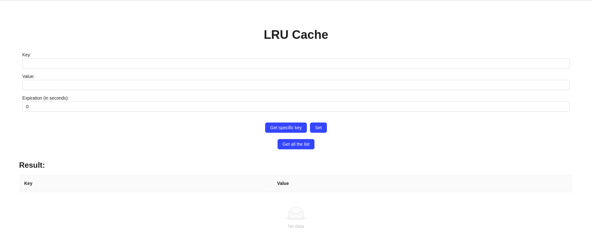

# LRU WEBAPP
## 1st step
Clone the repo
```
git clone https://github.com/mridul217/LRUwebapp
```
move inside the folder 
```
cd LRUwebapp
```

## Run using docker
```
# to build the docker services
docker compose build

# to start the docker services
docker compose up -d

# to stop the docker services
docker compose down
```
## Run without using Docker

### run the backend server
```
cd backend
uvicorn main:app --reload

# backend server will start on localhost:8000
```
### run the frontend server
```
cd frontend # one should be present in root directory
npm start

# frontend server will start on localhost:3000
```

## Screens of the react app



